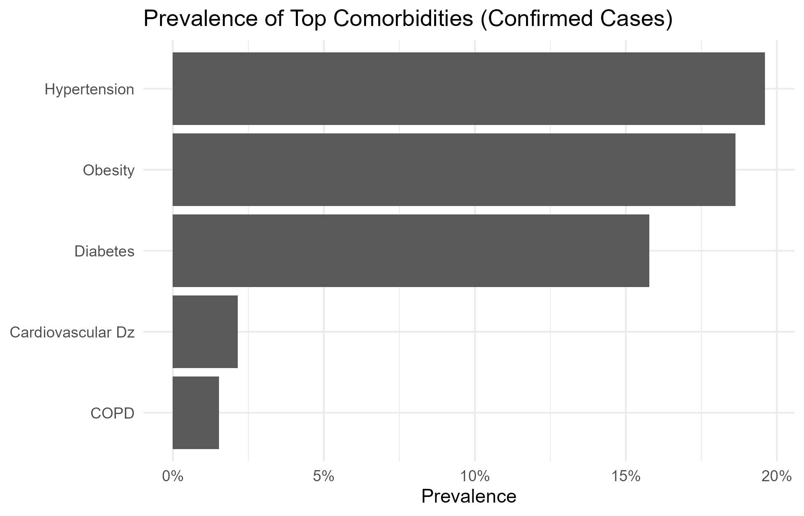
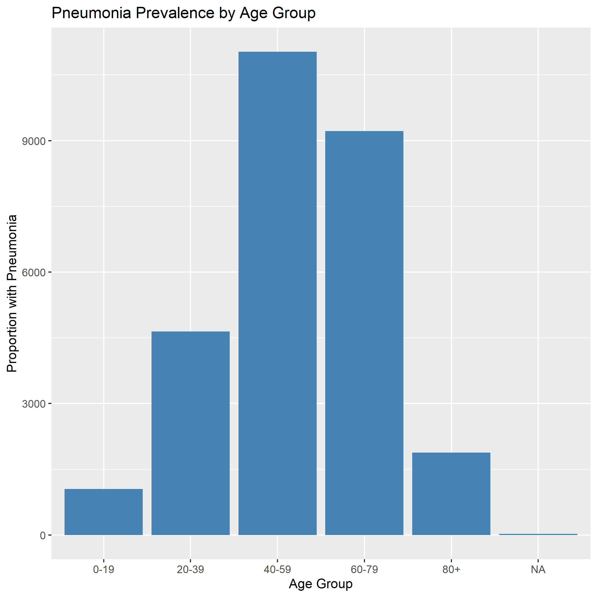
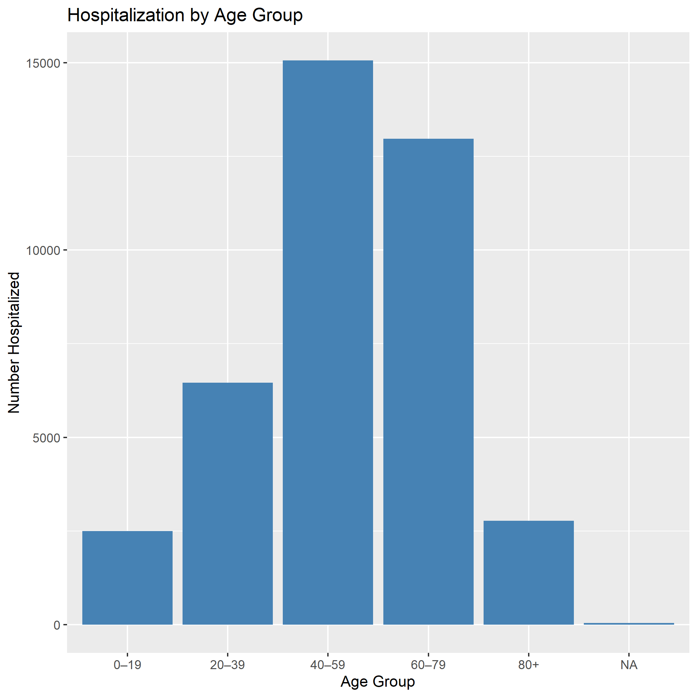
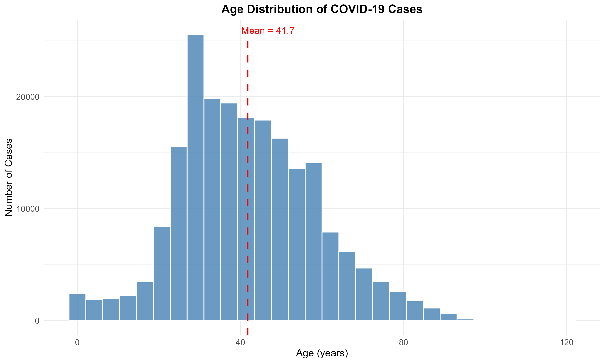

```{r setup, include=FALSE}
knitr::opts_chunk$set(echo = TRUE, warning = FALSE, message = FALSE)
library(knitr)
library(ggplot2)
library(dplyr)
```

# Executive Summary

This report summarizes COVID-19 case data using a reproducible workflow involving modular R scripts, renv package management, and a Makefile-driven pipeline. The analysis examines case classifications, comorbidity burden, mortality patterns, pneumonia prevalence, hospitalization rates, and demographic distributions. Results highlight well-established epidemiologic patterns, including elevated severity among older adults, individuals with comorbidities, and patients requiring ICU care or intubation. Findings provide insight into key predictors of severe COVID-19 outcomes and support targeted public health interventions.

## Introduction

The COVID-19 pandemic has generated substantial global morbidity and mortality, emphasizing the critical role of surveillance data in understanding disease severity and informing public health responses. This report analyzes a surveillance-derived dataset to examine clinical and demographic predictors associated with severe outcomes.

Using a fully reproducible analytic pipeline, we summarize case classification patterns, explore the influence of comorbidities, evaluate mortality across clinical severity indicators, and describe age- and sex-related trends. Each analytic component was generated by a team member using structured R scripts, and all outputs were compiled into this integrated report. Collectively, the findings highlight key determinants of COVID-19 severity and underscore the value of structured, collaborative epidemiologic analysis.

## Methods

This report was generated through an automated reproducible pipeline using:

- R for data processing and visualization

- renv for package version control

- Makefile for orchestration of all analysis scripts

- R Markdown for final report assembly

### Data Source

All analyses use covid_sub.csv, which includes individual-level case information such as demographics, comorbidities, pneumonia status, hospitalization category, and mortality outcomes.

### Analytic Workflow

Each team member contributed a specific R script housed in the code/ directory. Scripts performed:

- data cleaning and recoding

- table creation stored in output/tables/

- figure generation stored in output/figures/

- computation of case fatality rates (CFR)

- stratified summaries across clinical and demographic subgroups

The entire workflow is executed using:

```bash
make report
```
which regenerates all outputs and renders report.html.

---

# 1. Case Classification

### Interpretation

Case classification provides foundational insight into the distribution of confirmed, suspected, and other case categories. Understanding this distribution helps contextualize all downstream severity outcomes, as classification patterns may reflect variations in testing practices, reporting completeness, or surveillance definitions.

## Classification Summary

```{r table1}
classification_data <- read.csv("output/tables/classification_summary.csv")
kable(classification_data, 
      caption = "Table 1: Distribution of Case Classifications",
      col.names = c("Classification", "Count", "Percent"))
```

## Classification Distribution

```{r figure1}
knitr::include_graphics("output/figures/classification_distribution.png")
```

The bar chart indicates that several classification categories dominate the dataset. These proportions illustrate the underlying surveillance structure and provide important context when interpreting severity measures later in the report.

---

# 2. Comorbidity Analysis

### Interpretation

Comorbid conditions are major predictors of severe COVID-19 outcomes. Individuals with underlying chronic disease typically experience higher case-fatality risks and more severe clinical presentations. This section evaluates the distribution of comorbidities and their effect on CFR within the dataset.

## CFR by Comorbidity Status

```{r table2}
cfr_comorbidity <- read.csv("output/tables/cfr_by_comorbidity.csv")
kable(cfr_comorbidity, 
      caption = "Table 2: Case Fatality Rate by Comorbidity",
      col.names = c("Comorbidity", "Cases", "Deaths", "CFR"),
      digits = 4)
```

The table shows a substantially higher CFR among individuals reporting at least one comorbidity, consistent with global evidence that chronic disease elevates the risk of adverse outcomes.

## Top Comorbidities Prevalence

```{r figure2}

```

This figure highlights the most frequently reported comorbidities. High prevalence of certain conditions, such as diabetes or hypertension, reflects the clinical risk profile of the dataset and aligns with known drivers of COVID-19 severity.

---

# 3. Mortality Analysis

### Interpretation

Mortality is strongly influenced by indicators of clinical severity. ICU admission and intubation reflect the most severe forms of respiratory compromise, and substantial mortality differences are expected across these subgroups.

## Mortality by ICU Admission and Intubation

```{r table3}
mortality_data <- readRDS("output/tables/mortality.rds")
mortality_data
```

## Mortality by ICU Admission

```{r figure3}
knitr::include_graphics("output/figures/sbs_bar_admit.png")
```

Individuals admitted to the ICU exhibit markedly higher mortality, consistent with the expected severity profile of patients requiring intensive monitoring or respiratory support.

## Mortality by Intubation Status

```{r figure4}
knitr::include_graphics("output/figures/sbs_bar_intub.png")
```

Mortality is substantially higher among intubated patients, reflecting the critical nature of cases requiring mechanical ventilation. This pattern mirrors clinical observations throughout the pandemic.

---

# 4. Pneumonia and Hospitalization

### Interpretation

Pneumonia is a key clinical manifestation of COVID-19, often associated with older age and more severe outcomes. Hospitalization patterns similarly reflect disease severity and age-related risk.

## Pneumonia Status by Age

```{r table4}
pneumonia_data <- readRDS("output/tables/Pneumonia_status.rds")
kable(pneumonia_data, 
      caption = "Table 4: Pneumonia Status by Age Group",
      col.names = c("Age Group", "Total Cases", "Pneumonia Cases"))
```

```{r figure5}

```

The figure illustrates an increasing prevalence of pneumonia with advancing age, consistent with age-related vulnerability to lower respiratory tract involvement.

## Patient Type (Hospitalization) by Age

```{r table5}
patient_type_data <- readRDS("output/tables/patient_type.rds")
kable(patient_type_data, 
      caption = "Table 5: Hospitalization Rates by Age Group",
      col.names = c("Age Group", "Total Cases", "Hospitalized", "Rate"),
      digits = 3)
```

```{r figure6}

```

Older age groups show higher hospitalization rates, reflecting increased severity requiring inpatient care. These patterns reinforce age as a critical determinant of clinical risk.

---

# 5. Demographics

### Interpretation

Demographic differences, particularly age and sex, influence observed COVID-19 outcomes. This section describes CFR by sex and the overall age distribution of the dataset.

## CFR by Sex

```{r table6}
cfr_sex <- readRDS("output/tables/cfr_by_sex.rds")
kable(cfr_sex, 
      caption = "Table 6: Case Fatality Rate by Sex",
      col.names = c("Sex", "Total Cases", "Deaths", "Survivors", "CFR (%)"))
```

Male individuals display slightly higher CFRs compared to females, consistent with documented global epidemiologic trends.

## Age Distribution

```{r figure7}

```

The age distribution plot contextualizes the demographics of the dataset and helps interpret variations in severity across subgroups.

---

# Discussion

This analysis reveals several consistent epidemiologic patterns observed throughout the COVID-19 pandemic. Individuals with comorbidities, older adults, and patients requiring ICU admission or intubation exhibit significantly higher mortality. Pneumonia prevalence and hospitalization rates rise sharply with age, reinforcing the vulnerability of older populations. Sex-specific CFR differences are present but smaller in magnitude relative to age and comorbidity effects.

These findings underscore the interplay between demographic risk factors and clinical severity markers. Understanding these relationships is critical for resource allocation, risk communication, and clinical decision-making during respiratory disease outbreaks.

# Conclusions

This report integrates multiple epidemiologic indicators to provide a comprehensive assessment of COVID-19 severity patterns. The reproducible analytic pipeline ensures transparency and repeatability, allowing future updates with new datasets. Findings reinforce established public health evidence: age, comorbid conditions, and severe clinical presentation remain key predictors of adverse outcomes. This framework can be extended for ongoing surveillance, emerging variants, and evaluation of interventions.

---